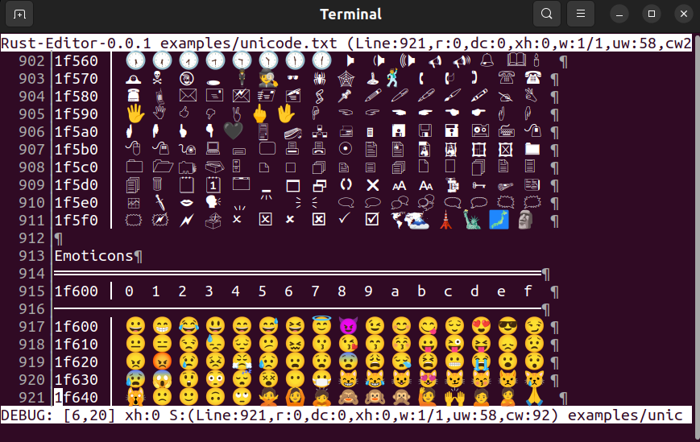

An experiment writing a terminal editor in Rust.

- Simple
- Modal
- Fast
- Extensible
- Reliable

**Why another editor?**

I've used a lot of editors.  And I like a lot of them, but each has had their own strengths and weaknesses.  I'm drawing a lot of inspiration from Emacs, Neovim, Idea, and VSCode.  I often find I only use a fraction of the features available, but still wanting more.  I also have some ideas about what an editor could be, and this is an attempt to put those ideas into code.  It's also an exercise in building a large, complex application, and being able to create clean composible APIs to make maintenance and refactoring as easy as possible.

And, I think user interfaces have gotten worse over the years.  I think I can do better.

**Why Rust?**

After many years of wandering in the desert of weakly typed scripted languages searching for the ultimate, I started to miss my early days of C/C++ development, which I haven't really touched in over 10 years.  So much has happened in C++ world since.  I started looking into it, and it's almost a new language!  It seemed like a big learning curve, even though I've programmed in it for years.  Rust seemed to offer the best of C++ without any of the drawbacks.

The more I use Rust, the more I appreciate the hardwork that went into it's design.  I also love getting new features every release, it's commitment to backwards compatibility, and most importantly Safety!  Life is too short to be up all night tracking down race conditions and null pointer exceptions.  I was playing a video game earlier this year that crashed, right as I was in the middle of it.  I couldn't believe it.  But that's normal in the C++ world.  It's a tough job for a developer to track all of those bugs down.  No time for that any more.  What I love about Rust, is that often, if it compiles, it just works.  Something also claimed by the Elm people.  I think that's the future of programming.  Using anything else is just using ancient tools that are on the way out.

### What I don't like

Some things I really don't like in other editors:

Idea - Too bloated, so much RAM for so little power.  UI isn't well integrated.  Terminal support is poor.
Neovim - I've spent less time creating this editor so far than I have tweaking my config files. The vim language is nice in some ways, but clunky in others.  It's really just a hard to undertand DSL for a code editor.  It's very clever, but you don't get points for being clever these days.  Terminal support is poor.
Emacs - Simple and elegant on the outside, bloated on the inside.  Not wanting to go there.  I just want a spoon, I don't need a tacky china set.  Terminal support isn't there as much as it is hyped to be.
VSCode - poor UI experience and bad terminal.

### What I like

What I like about other editors:

Idea - Excellent LSP support and integration with language tooling.
Vim/Neovim - It's modal, and it has macros.
Emacs - very configurable using emacs lisp.

Goals:

- Create a usable editor for development
- Create a composible Rust API for exploring novel editor ideas.
- Strong terminal integration.  I spend just as much time in the terminal as I do in the editor.  What if I didn't have to leave the editor?
- Remove limitations of current state of the art editors.
- Use the best of Rust, and learn more about it.

Ideas I want to explore:

- Create a better bash/zsh terminal experience.  While zsh is a big improvement in some ways, it's only incremental. I'd like to imagine what the terminal experience can be by analyzing my day to day workflow and then designing a terminal experience to suit that workflow
- Live editing possibilities.  Editing data like code, getting real-time feedback on the code you write.
- I use tmux as glue between multiple neovim instances, and multiple terminal instances.  This is not as flexible as I would like, and I would like some better integration.

Non-Goals:

- compatibility with Vim, Emacs or any other editor.  They are mature and aren't going any where.  Mostly not interesting.

## Next steps

Some next steps toward self hosting development, that is, developing this editor using this editor.

### Minimal Viable Product

- [x] Loading files from commandline
- [x] Unicode support
- [x] Word wrap and basic editing (insert, delete)
- [x] Multiple buffers
- [x] Mouse and keyboard scrolling
- [x] Background file save
- [x] Basic file search
- [x] Status bar and Header
- [x] Delete to character motion, Delete entire line (dt{char}, dd)
- [x] Yank, Paste, Join, Word Editing, New Lines (y, p, P, yy, J, cw, dw, o, O)
- [x] Highlight search terms
- [x] Repeat last command (.)
- [x] Basic EditorConfig support for tabs and spaces
- [ ] Expand tab, and no expand modes (expandtab, noet, tabstop(ts), )
- [ ] Tab detection - be able to edit files with spaces for tabs, and Makefiles appropriately
- [ ] Create a new file, or open an existing file from inside the editor (:e <filename>)
- [ ] Undo/Redo
- [ ] Indent/Dedent (<, >)
- [ ] Basic Visual mode
- [ ] Fuzzy file search and open
- [ ] Suspend/Resume (sort of working) (^Z)
- [ ] Automated build and release
- [ ] International support (all UTF-8)

### Notes on current work

Fixing UTF-8 handling
- https://unicode-rs.github.io/unicode-segmentation/unicode_segmentation/struct.GraphemeCursor.html

Glob search
- https://docs.rs/globset/0.4.6/globset/

Tabbing
- https://vim.fandom.com/wiki/Super_retab

Fuzzy search
- https://github.com/BurntSushi/fst
- https://github.com/andylokandy/simsearch-rs
- https://docs.rs/ngrammatic/0.3.2/ngrammatic
- https://github.com/lotabout/fuzzy-matcher
- https://github.com/Schlechtwetterfront/fuzzy-rs
- https://docs.rs/strsim/0.10.0/strsim/
-
terminal emulation
- https://github.com/wez/wezterm/tree/master/term/src
- https://github.com/alacritty/alacritty/tree/master/alacritty_terminal/src
- https://github.com/dflemstr/mux/tree/master/terminal-emulator
- https://github.com/ftilde/unsegen_terminal
- https://docs.rs/unsegen_pager/0.2.0/unsegen_pager/

Interesting Hobby editors
- https://github.com/mathphreak/mfte
- https://crates.io/crates/kiro-editor
- https://viewsourcecode.org/snaptoken/kilo/
- https://github.com/mathall/rim
- https://github.com/vamolessa/pepper
- https://amp.rs/
- https://github.com/gchp/iota
- https://github.com/mathphreak/mfte

Subprocess management
- https://github.com/hniksic/rust-subprocess

Text wrapping:
- https://github.com/mgeisler/textwrap
- https://github.com/ps1dr3x/easy_reader
- https://github.com/danielpclark/array_tool (Justification and string navigation)

Bling
- https://github.com/Phate6660/nixinfo

Scripting
- https://docs.mun-lang.org/

GUI
- https://github.com/tauri-apps/tauri

Rust Style and improvements
- https://github.com/JasonShin/fp-core.rs
- Iterator help: https://docs.rs/itertools/0.10.0/itertools/

EditorConfig
- https://github.com/mathphreak/mfte/commit/0787891f370a5ef66ee85351cab4468fc3fd518b
- https://crates.io/crates/editorconfig

handling signals in terminal:
- https://docs.rs/signal-hook/0.3.4/signal_hook/index.html
- https://github.com/Arkham/c_examples/blob/master/apue/signals/sigtstp.c

use ambassador to cleanup some delegated interfaces that are currently using deref inappropriately
- https://crates.io/crates/ambassador

Persistent data structures:
- https://github.com/orium/rpds

Remove abuse of unwrap:
- https://docs.rs/anyhow/1.0.38/anyhow/

Get some profiling going
- https://github.com/tikv/pprof-rs
- https://www.jibbow.com/posts/criterion-flamegraphs/

Vim Notes
- https://irian.to/blogs/introduction-to-vim-modes/

### Known Bugs

- Suspend doesn't work exactly as expected.  Work around is to hit Ctrl-Z twice
- Performance is currently very poor

### More Advance Features

- [ ] Multiple windows
- [ ] Multi-project support (multiple working directories and code bases)
- [ ] Run terminal applications inside the editor (similar to tmux, screen or tab)
- [ ] Integrate with tree sitter, syntect or similar for syntax highlighting
- [ ] LSP support
- [ ] Rust support (rust-analyzer)
- [ ] Python support
- [ ] Autoformat support
- [ ] Markdown support (including preview)
- [ ] Macros
- [ ] Auto indentation
- [ ] Support non-word wrapped line editing
- [ ] Support all 8 text orientations (yes, there are 8!)
- [ ] System copy/paste support.  Better support for copy and paste in the editor.
- [ ] Integration with external programs via cli (stdin, stdout), such as fzf, ag, etc.
- [ ] Git integration
- [ ] Dynamic keybindings
- [ ] Script support for editor configuration, with live edit support
- [ ] Basic themes (i.e. gruvbox)

### Future Interesting Ideas

- [ ] Read only tail file - use a buffer to tail the end of a log file
- [ ] handle pathological files (very long lines, very large files, binary files)
- [ ] OpenGL renderer and integration.  OpenGL opens up a number of UI possibilities that just aren't possible in the terminal.
- [ ] Integrate web browser tabs into the development experience.  I spent a lot of time browsing documentation.  That browsing should be integrated into the editor experience. Since I spent most of my time in the editor, terminal or a browser.  If I can integrate those 3, then I really never need to touch anything else on the OS.  It could potentially be it's own window manager.
- [ ] Investigate creating a Wayland compositor using similar ideas.
- [ ] Cross-compile for WASM, and run inside a browser
- [ ] Create a DSL for composing the editor elements.  Rather than extending using plugins, I want a developer to be able to compose primitives and create a completely different application.  Plugins might have their place, but I want the real power to be on the composible elements.

### Further Reading

[The Craft of Text Editing](http://www.finseth.com/craft/)
